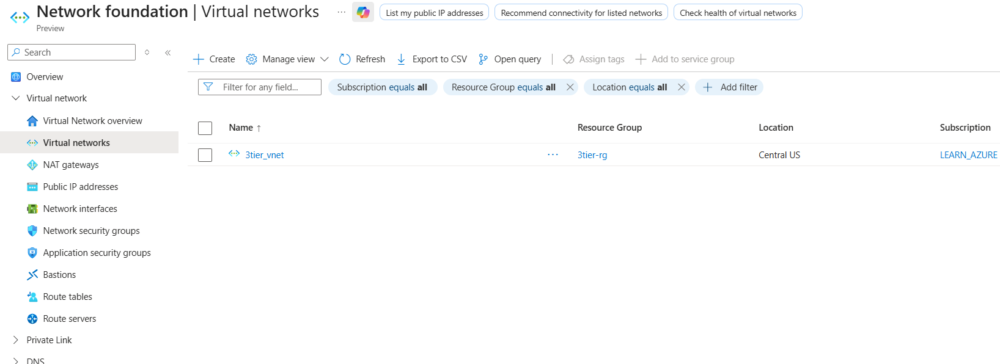

# Terraform Azure 3-Tier Infrastructure

## Overview

This project provisions a basic 3-tier infrastructure on Microsoft Azure using Terraform.

The infrastructure is designed to demonstrate Infrastructure as Code (IaC) best practices by creating reusable Terraform modules and deploying Azure resources in an automated manner.

## Architecture

Current implementation includes:

* Resource Group
* Virtual Network (VNet)
* Subnet(s)
* Linux Virtual Machine (Web Tier)

Future phases will include:

* Application Tier Virtual Machine(s)
* Database Tier
* Network Security Groups (NSGs)
* Load Balancer
* Availability Sets
* Monitoring and Backup solutions

## Technologies Used

* Terraform
* Microsoft Azure
* Azure CLI
* Git & GitHub

## Prerequisites

Before deploying this infrastructure, ensure the following are installed:

* Terraform (v1.0 or later)
* Azure CLI
* Git

## Project Structure

```text
terraform-azure-3tier/
├── main.tf
├── provider.tf
├── variables.tf
├── output.tf
├── .gitignore
├── README.md
└── modules/
    └── vm/
        ├── main.tf
        ├── variables.tf
        └── outputs.tf
```

## Deployment Steps

Initialize Terraform:

terraform init


Validate configuration:

terraform validate

Review execution plan:

terraform plan

Deploy infrastructure:


terraform apply


Destroy infrastructure:


terraform destroy


## Current Deployment

* Resource Group: `3tier-rg`
* Virtual Machine: `web-vm`
* Operating System: Linux

## Future Enhancements

* Implement complete 3-tier architecture
* Add remote state management using Azure Storage Account
* Integrate CI/CD using GitHub Actions
* Add monitoring and alerting
* Improve security using NSGs and Key Vault


## Project Structure


## Virtual Network



## Virtual Machine Deployment


## Azure Resource Group Resources


## Author

Shiva Rawal

Junior DevOps Engineer
